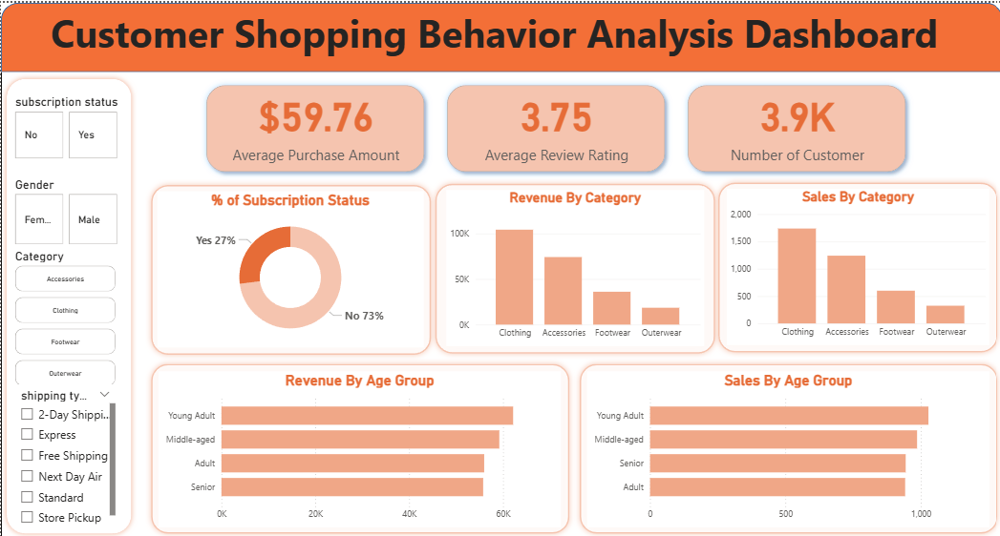

# Customer Shopping Behavior Analysis

## 📌 Overview
This end-to-end data analytics project uncovers key purchasing habits, consumer demographics, and revenue drivers for a retail ecosystem. The project spans the entire analytical pipeline: from importing and executing exploratory data analysis (EDA) in **Python**, running targeted data extraction queries via **MySQL**, to delivering a high-impact interactive **Power BI** dashboard and executive presentation slides. 

---

## 📊 Dataset Specifications
* **Source Format:** Microsoft Excel / CSV
* **Volume:** **3,900 unique customer records**
* **Core Metrics Tracked:** Average Purchase Amount, Review Ratings, Subscription Status, and Demographic Categories (Gender, Age Groups, Shipping Preferences).

---

## 🛠️ Tools & Technologies Used
* **EDA & Data Cleaning:** Python (Pandas, NumPy)
* **Database Querying & Segmentation:** MySQL
* **BI Dashboarding & Data Modeling:** Power BI Desktop
* **Reporting & Stakeholder Presentation:** Microsoft PowerPoint & Excel

---

## 📈 Project Workflow & Steps

### 1. Exploratory Data Analysis (EDA) & Data Cleaning (Python)
* Loaded the raw Excel dataset into a **Jupyter Notebook** using Pandas.
* Handled missing review ratings, standardized categorical columns, and eliminated structural data inconsistencies.
* Performed initial statistical profiling to isolate average consumer transaction baselines.

### 2. Relational Database Manipulation (MySQL)
* Imported the cleaned dataset into a local **MySQL Server** instance.
* Authored optimized SQL queries featuring aggregates, joins, and filters to group revenue by age, categorical product lines, and gender distributions.

### 3. Interactive Data Visualization (Power BI)
* Configured a clean data schema to model shopping metrics dynamically.
* Formulated custom DAX measures to track user subscription ratios and group performance indices.

### 4. Stakeholder Delivery (Report & PowerPoint)
* Documented core findings into a technical project report.
* Compiled data insights into a streamlined PowerPoint deck focusing on marketing actionable recommendations for non-technical stakeholders.

---

## 🖥️ Dashboard Layout & Insights


The custom-designed dashboard features an intuitive sidebar slicing panel and details three key operational focus areas:
1. **High-Level KPIs:** Instant visibility into transaction values and customer loyalty metrics.
2. **Category Deep-Dives:** Visual comparisons analyzing overall product demand versus financial revenue capture.
3. **Demographic Segmentations:** Horizontal bar chart break-outs evaluating chronological purchasing power by distinct consumer age groups.

---

## 🏆 Key Results & Data Insights

* **The Core Revenue Engine:** Average individual customer purchase amount settles firmly at **\$59.76**, maintaining a healthy product satisfaction review rating averaging **3.75 out of 5**.
* **Gender Spend Dynamics:** Advanced SQL queries and dashboard metrics revealed that **Male customers generate 67% (\$157.9k) of total platform revenue**, pointing to a major market segment.
* **The Prime Age Demographic:** **Young Adults** represent the highest-performing consumer cluster, yielding a commanding **\$62,143 in sales volume**. 
* **Subscription Loyalty:** Only **27% of shoppers are active subscribers**, leaving a massive **73% non-subscription pool** ripe for targeted loyalty campaign conversions.
* **Product Line Leaders:** **Clothing and Accessories** drastically outperform Footwear and Outerwear in both direct sales counts and total revenue generated.

---

## 📂 Repository Structure
```text
├── scripts/              # Jupyter Notebook (.ipynb) containing the Python EDA code
├── sql_queries/          # MySQL script files (.sql) tracking customer segmentations
├── dashboards/           # Interactive Power BI file (.pbix)
├── presentation/         # Executive PPT slide deck and final project report
└── README.md             # Project documentation and summary
